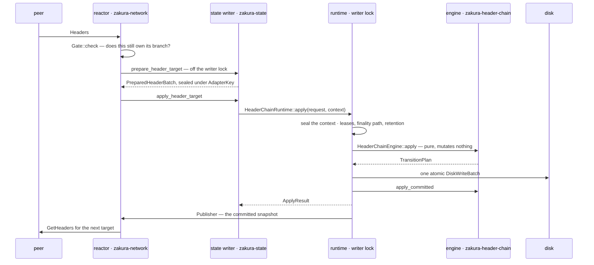

# How one request moves through the header chain

This guide follows one delivery of headers from the socket to the planner and back. It
explains why the path crosses so many boundaries and what each boundary prevents. The
[fork-aware header-chain specification](../../specs/fork-aware-header-chain-engine.md)
remains authoritative; rules appear here as `LC-*` citations. The companion guide
`production_code_header-chain.md` names the files that implement each part.

## Why one planner decides the chain

Four sources can move the tip. Peers deliver headers. Full state verifies bodies. A node
administrator excludes or restores a block through `invalidateblock` and
`reconsiderblock`. Finality advances.

If each source computes the move, the node runs as many fork-choice implementations as it
has sources, and they can disagree. Timing breaks it even when they agree: a source that
computed its answer against an old view lands late and overwrites a newer one. That is the
production failure this design replaced.

So one planner decides. Each source reports what it observed, and the planner turns that
evidence into every consequence.

The rule holds only while no source can reach past its own layer. A layer that can reach
the database, publish a frontier, or supply the history its own claim is judged against
can restate fork choice in its own terms, and then the node has two planners again. Each
boundary is therefore carried by a type rather than by a convention: the value that
crosses is shaped so the mistake the boundary exists to prevent cannot be expressed.

Each section below names what crosses, what the sender cannot do, what the receiver
guarantees, and the types that hold the line.

## The round trip

The reactor does not learn what happened from the value its own call returned. It learns
from the publisher, so every scheduling decision it makes stands on a frontier that is
already on disk.

Two methods are named `apply` and they promise opposite things.
`HeaderChainEngine::apply` takes `&self`, mutates nothing, and returns a plan the caller
may drop. `HeaderChainRuntime::apply` writes a batch, installs the plan, and publishes.
This document always writes both names in full.

## Who decides what

Each layer decides one thing. The reactor owns peers, sockets, and timers, and decides
nothing about the chain. The state writer decides when a transition runs and what else
lands in the same write. The runtime decides which history the evidence is judged against.
The engine decides which chain is best.

What each layer cannot do defines it just as much. The reactor cannot reach the database,
run a selection, or publish a frontier. The state writer cannot decide what a transition
means. The runtime cannot invent a fact the store does not hold. The engine cannot perform
an effect at all, so it cannot commit the answer it derives, and something else must carry
that answer to disk.

The build enforces two of those prohibitions. The `Port` trait in
`zakura-node-services/src/header_chain.rs` lists the operations the reactor may call, so
the database is not in the reactor's vocabulary and a direct call from `zakura-network`
into `zakura-state` would invert the crate stack. The
`architecture_dependencies_stay_sync_only_and_layered` test fails the build when the
engine manifest names `tokio`, `tower`, `zakura-state`, `zakura-network`, or
`zakura-consensus`, so purity is checked in the dependency graph rather than in review
(LC-SCOPE-06).

## Peer to reactor

**What crosses.** A `Headers` message on the header-sync stream. The message set is
closed, so new wire data needs an advertised auxiliary schema bit or a successor stream
version (LC-WIRE-15). A peer that cannot speak the current stream version never negotiates
the stream rather than half-speaking it.

**What the sender cannot do.** The reactor derives no chain fact from the message. The
height a peer attaches to a header is never evidence, because height comes from a checked
parent increment further down. A request id is nonzero by wire construction (LC-WIRE-01),
so zero decodes as a failure rather than matching every outstanding request. The codec
bounds every collection before it allocates.

**What the receiver guarantees.** The reactor decides when to ask, whom to ask, and how
much to ask for, because those are timing questions and it holds the only timer. Whether a
header is valid, which chain is best, and whether a late response still counts are all
decided below it.

**The types.** The reactor owns no chain state. Its scheduler keys every unit of work by
generation and branch, so one retirement pass retires exactly the work a reset invalidated
and leaves the rest alive.

| Abstraction | Location | Unrepresentable mistake |
| --- | --- | --- |
| `BranchId` | `zakura-header-chain/src/ids.rs` | naming a branch by height. It is `(anchor_hash, target_tip_hash)` and carries no height field, so a reset to a different chain of equal height cannot pass for the same branch |
| `Gate` | `zakura-header-chain/src/ownership.rs` | a response acting before anyone asked whether it still owns its branch. It is the sole decision point over `PendingOwners` |
| `PendingOwners` | `zakura-header-chain/src/ownership.rs` | an owner surviving its peer's reconnect. The key is `(SourceId, request_id)` and the owner carries the session id, so a reply on a new session for an old request is `OwnerMismatch` |

### When a late response is stale

`Gate::check` compares the durable coordinates first — the branch anchor,
`header_generation`, and, for body-authorized work, `verified_generation` — then consults
the registry, and returns `Current` or a typed stale reason.

It deliberately ignores `state_version`. That counter advances on every committed
transition that can affect a frontier, including transitions on branches a given request
never touches, so binding header work to it would cancel in-flight requests faster than
they complete for no correctness gain.

A stale decision produces no frontier, coverage, retry, repair, scheduling, publication,
body-task, or peer-score effect (LC-GEN-04, LC-ACCEPT-03). A peer that answered honestly a
moment too late is not misbehaving. This gate only avoids wasted work. The planner repeats
the same comparison against the pre-transition snapshot with `validate_header_sync_owner`,
and that check is the authority.

## Reactor to state writer

**What crosses.** `prepare_header_target` outbound, a sealed `PreparedHeaderTarget`
inbound, and `apply_header_target` outbound again. Both are port operations, implemented by
the driver in `zakurad`, the only place where header-sync policy and the state service know
each other's names.

Preparation runs off the writer lock, on a blocking thread. It reads a validation lease for
the common ancestor through the read service, derives the rules in force at that height
from that lease, and runs `prepare_context_free_headers`. Those are exactly the rules that
read no ancestor, such as canonical version and hash, checked height inference, commitment
structure, compact-target domain, and Equihash.

**What the sender cannot do.** The reactor cannot forge or substitute a prepared batch
between the two calls. A header whose time runs more than two hours ahead of the local
clock comes back `DeferredUntil` rather than rejected (LC-VAL-08), so our own clock skew
never becomes a peer fault.

**What the receiver guarantees.** Preparation off the lock weakens nothing. Once the lock
is held, the planner trusts no conclusion preparation reached: it rechecks the receipt
against the live config, and a batch prepared under a config that has since moved fails
with `StalePreparation` (LC-VAL-11).

| Abstraction | Location | Unrepresentable mistake |
| --- | --- | --- |
| `AdapterKey` | `zakura-node-services/src/header_chain.rs` | a prepared batch substituted between the two calls. The adapter seals the target on the way out and is the only holder that can open it on the way back, which is what makes two calls as safe as one |
| `PreparedHeaderBatch` and its receipt | `zakura-header-chain/src/transition/types/preparation.rs` | a result that does not say what it was prepared against. The receipt names the parent frontier, the network, and the trust-anchor digest, all three rechecked in the planner |

## State writer to runtime

**What crosses.** `HeaderChainRuntime::apply(request, context)`, or one of two wider
shapes. Every production call is in `crates/zakura-state/src/service/write.rs`, and nothing
outside `zakura-state` holds a runtime, so transitions serialize by construction.

Three kinds of caller reach that file. The reactor arrives through `ApplyHeaderChainInsert`
on the write task's channel. The state writer itself submits block commits, body outcomes,
auxiliary results, verified-chain changes, finality, and operator actions. The write loop's
timer submits `ReevaluateDeferred` when the deadline from `earliest_deferred()` elapses,
which is the one transition no component observed.

**What the sender cannot do.** The state writer decides when a transition runs and what
else lands in the same write. It does not decide what the transition means, and it cannot
publish: the reactor holds no runtime, and the runtime is the sole publisher (LC-GEN-05).

**What the receiver guarantees.** One committed transition makes one `db.write`
(LC-TXN-01). The runtime writes the store once per transition, inside the writer lock, with
no accumulation and no background flush. The three call shapes differ only in how much goes
into that one write.

`apply` writes the header-chain rows alone. `apply_combined` appends those rows to the
block batch the state writer already filled, because a block and the header node it depends
on must not disagree across a crash and one batch is the only way to guarantee that
(LC-INT-03). `apply_aux_then_checkpoint_combined` plans auxiliary authentication and the
checkpoint advance that depends on it into that same batch.

That range of widths is also why the engine hands its write set back instead of performing
it. It can neither open the batch, which spans full-state column families in a crate it
must not link, nor close it, since the runtime may still add a second transition.

Two writes sit outside this path, both before the engine exists. Startup commits one repair
batch when the audit is not clean, and a first run against a store that predates the DAG
commits the migration batch that builds the initial nodes and the migrated finality pin.

| Abstraction | Location | Unrepresentable mistake |
| --- | --- | --- |
| `HeaderChainRuntime` | `zakura-state/src/service/finalized_state/header_chain.rs` | a second writer or a second publisher. It holds the store, the engine mutex, the publisher, and the lease registry, and nothing outside the crate holds one |
| `ApplyResult` | `zakura-header-chain` | an ambiguous outcome. `Committed`, `NoChange`, `Stale`, and `ResourceStalled` are distinct, so `FullStateResourceStalled` is a case the writer must handle rather than a success it can assume |

## Runtime to engine

**What crosses.** The typed event, the transition context, and the durable facts
(`HeaderValidationFacts`, `HeaderInsertionFacts`): what holds still across the run, and the
durable rows this one transition reads. The engine fetches nothing, so a gap in either is a
refusal, never a default the planner invents.

### Why the runtime supplies the context

A header is not valid or invalid by itself. Zcash derives expected difficulty from
`MedianTime(height) - MedianTime(height - PoWAveragingWindow)`, so checking one header
takes the 17 headers of the averaging window plus the 11 of the median span, 28 blocks in
total. That window also fixes the median-time-past that bounds the header's own timestamp,
and the height decides which rules apply at all. One header is therefore valid below one
branch and invalid below another: validity is a claim about a header and a stretch of
history together.

Something must choose that history, and it must not be whoever supplied the header. A peer
that also chose the 28 predecessor facts would be choosing the difficulty its own header is
compared against, and a fabricated but well-formed window would pass. The context is
exactly what an untrusted source may not supply.

So the runtime chooses it. Under the lock that will commit the transition, it reads the
parent and the predecessors below it from its own committed store, and seals them with the
network policy and the trust-anchor digest into one validation lease.

Finality moves that history while requests are in flight, which is the second thing the
runtime supplies. Advancing `finalized` moves the anchor, so a batch authorized below the
old one no longer roots anywhere. `validate_finality_rebase_path` walks the durable
finality history back from the current anchor to the owner's original one, all or nothing,
and a second lease for the pre-transition anchor travels with it, so the planner re-roots
only when the move is proved (LC-FINAL-01). The third is retention: merged serving-lease
references keep a page a peer is reading from being evicted (LC-WIRE-05).

The division is the same for every event. The caller supplies what it observed, and the
runtime supplies what the observation is judged against.

**The types.** This boundary carries the capability model. The runtime vouches for the
evidence it hands over, and the engine refuses evidence nobody vouched for.

| Abstraction | Location | Unrepresentable mistake |
| --- | --- | --- |
| `ValidationLease` | `zakura-header-chain/src/transition/types/preparation.rs` | predecessor facts arriving loose. Parent, predecessor facts, network policy, and trust-anchor digest are sealed under one `context_digest`, and `is_coherent` re-derives that digest and re-walks the backward hash links (LC-ANCHOR-03) |
| `StateIssuedAuthority` | `zakura-state/src/service/finalized_state/header_chain.rs` | a lease from anywhere but this call. It wraps the caller's authority over exactly the leases the runtime just issued |
| `FullStateEvidenceAuthority` | `zakura-header-chain/src/transition/authority.rs` | an implementation that admits evidence by omission. Every method except `authorizes_full_state` defaults to `false`, and the transition context holds the authority as an `Option`, so absent authority has no representation but `TransitionFailure::Authority` |

### Evidence with no bounded window

Some evidence answers to no fixed number of predecessors. Peer-supplied note-commitment
roots are the example. Nothing below the last checkpoint verifies the header commitment
field they feed, and authenticating one takes a running ZIP-221 history tree over the
committed body tip and every selected header above it. That is history with no bound, which
no lease can seal, so that evidence never travels through one.

The state writer owns a durable ascending root-authentication frontier instead, advances it
against its own history-tree frontier, and reports each verdict back as ordinary auxiliary
evidence. The delivery is unauthenticated until that frontier clears it, and it drives no
validity and no fork choice in the meantime (LC-AUX-02, LC-AUX-04).
`docs/design/header-sync-vct-root-authentication.md` carries that design in full.

### How much history each event needs

What the runtime must prove about the past sorts the twelve events into three groups.

- **A sealed window.** `InsertHeaders` alone, the only event that admits material from an
  untrusted source.
- **One sealed predecessor.** The three verified-chain events, each leased against a
  different frontier, plus a pin refutation, which takes a durable row instead and only
  when the store holds that pin as migrated.
- **Nothing.** The other eight, whose evidence is self-contained. `FullStateFinalized` sits
  here despite doing the most: it moves the anchor and prunes every non-descendant while
  reading nothing, because the caller hands over the verified ancestry with it.

## Inside the engine

**What the engine cannot do.** Reach a disk, a socket, a task, or a clock of its own. Time
arrives through `Clock` and durable rows through the facts types, so the engine can observe
nothing it was not handed.

Purity here has its usual meaning: same inputs, same output, no effect the caller did not
ask for. The engine hides no state, because the caller passes it in.
`HeaderChainEngine::apply` takes `&self`, mutates nothing, and returns the next state as a
plan to commit. Planning the same event against the same state twice returns the same plan,
and dropping a plan leaves no write, no publication, and no change in the engine. Fork
choice is reproducible from a graph, a config, a clock, and an ordered event list, and
testable without a node.

Planning runs against an overlay rather than the graph itself. One implementation of
`HeaderGraphView` and `HeaderGraphEdit` runs against the overlay and the committed graph
alike, so selection cannot behave one way on staged state and another way on committed
state.

| Abstraction | Location | Unrepresentable mistake |
| --- | --- | --- |
| `GraphOverlay`, `GraphDelta` | `src/graph/overlay.rs` | planning that touches the live graph, or a hand-assembled difference. Reads see the base plus what the overlay staged, writes land in the overlay's own maps, and the delta's fields are crate-private |
| `TransitionPlan` | `src/transition/planner.rs` | a batch reaching disk that the planner did not derive. `change_set()`, `before()`, `cause()`, and `is_no_change()` are the whole caller surface; the delta and invariant inputs stay private |
| `before()` and `StaleSource` | `src/transition/engine.rs` | installing a plan against state it was not derived from. `HeaderChainEngine::apply` takes `&self`, so two planners can race, and only one can install |
| `Frontier` | `src/frontier.rs` | naming a position on a chain by height alone. It is a height and a hash together, and it is the only way this design names a position |
| `WorkCoordinate` | `src/frontier.rs` | comparing accumulated work across origins. It carries the origin hash, so a mismatched pair raises an error instead of yielding a smaller number that decides fork choice with nothing logged |
| `RetentionPlan` | `src/retention.rs` | a resource limit passing for a verdict about a chain. When protected paths alone fill the node bound it sets `admission_refused` and `resource_stalled` rather than evicting protected state or synthesizing finality for room (LC-RETAIN-01) |
| eligibility as durable reasons | `src/header_node.rs` | fork choice depending on arrival order. Ineligibility is a set of reasons rather than a flag, and a flag would make eligibility depend on update order |

### The four validation passes

Validation runs four times before disk, each pass against more context than the last.

1. **Off the writer lock**, `prepare_context_free_headers` runs the rules that read no
   ancestor and seals the result under a receipt.
2. **Under the lock, before planning**, the runtime reads the predecessor facts itself
   rather than accepting any the caller supplies, and seals them into leases.
3. **In the planner, against the graph**, the receipt's parent, network, and trust-anchor
   digest must still match the live config. The planner then re-derives, per header, the
   parent link, the hash, the height increment, and the work from the compact target, and
   runs the contextual difficulty and time check against ancestry it reads from the graph
   and the lease.
4. **After planning and before disk**, `verify_plan` re-derives the projected result:
   linkage and hashes, index round-trips, work coordinates, inherited eligibility, both
   projections' contiguity, that `header_best` really is the maximum eligible score,
   protected nodes, generation increments, and auxiliary provenance.

No pass trusts the one before it. The fourth checks the plan against a graph rebuilt from
the delta with `GraphOverlay::from_delta`, not against the overlay the planner mutated, so
the verifier approves the transition the engine will install rather than the one it staged.
A disagreement between the planner and the verifier is an `InvariantViolation`, and that
batch never reaches disk. Startup adds a pass that answers to no caller: `audit_store`
re-derives what the DAG determines before the engine exists.

**What crosses back.** `TransitionPlan`: the change set the store will write, the private
graph delta the engine will install, and `before()`, the snapshot it was derived from.

## Engine to disk, memory, and observers

**What crosses, and in what order.** The runtime writes disk, then memory, then observers.
Disk is what the next restart reads. A crash in that order leaves disk ahead of memory,
which the startup audit repairs by rehydrating from the authoritative node rows. In any
other order a crash can leave an observer holding a frontier that is not on disk, which
nothing repairs.

The schema, not the code path, is what makes that order repairable. The authoritative rows
are the per-node rows in `header_node_by_hash_v1` and the singleton in
`header_engine_meta_v1`. Children, heights, eligibility roots, deferrals, and both
projections are caches the startup audit rebuilds from those node rows.

`apply_combined_inner` is that path, and every call shape reaches it. It refuses on a
`migrated_pin_refuted` alarm before any effect, and checks a combined caller's staged
headers against the projected DAG before the write. Three outcomes then leave early.

- A no-change plan commits the caller's batch alone and publishes nothing.
- A `ResourceStalled` plan commits its alarm-only change set with a fresh batch, so the
  state writer maps that outcome to `FullStateResourceStalled` and stops rather than
  treating its own rows as written (LC-RETAIN-01).
- A plan carrying `migrated_pin_refuted` commits and installs, then returns without
  publishing, so the node fails closed on the alarm it just made durable (LC-FINAL-04).

A failure between the write and the install fails closed: the runtime returns the store
error, publishes nothing, and the next open rehydrates the engine from disk.

| Abstraction | Location | Unrepresentable mistake |
| --- | --- | --- |
| `FaultPoint` | `zakura-state/src/service/finalized_state/header_chain.rs` | an untested crash window. Ordered fault points let the recovery tests interrupt each step and check that reopening finds the complete before state or the complete after state (LC-ACCEPT-02, LC-RECOVER-02) |
| `audit_store`, `RecoveryPlan` | `src/transition/recovery/` | startup trusting a stored answer. It re-derives what the DAG determines, recomputes selection, and repairs only reconstructible categories, and it fails closed with publication still disabled on a store that is not one coherent chain (LC-RECOVER-01) |
| `apply_committed` | `src/transition/engine.rs` | memory disagreeing with disk. It is the only mutator, and it refuses a plan whose `before()` no longer matches |

## Runtime to peer

**What crosses.** A committed snapshot on a latest-value watch channel. `snapshot()` and
`subscribe()` are the entire published surface, and nothing else may publish (LC-GEN-05).

**Why the loop closes here and not on the return value.** The sole-publisher rule is the
direct fix for the failure this design replaced. A driver that published the raw result of
its own range commit could announce a frontier derived from work whose branch had already
been reset, so an obsolete completion undid that reset. Any component that publishes a
commit result it did not obtain from the serialized writer reintroduces the defect. The
reactor therefore learns what committed from the publisher, which means every frontier it
acts on is one the writer committed, in the order the writer committed them.

**What the reactor must do before acting.** A committed transition returns `RetiredWork`:
the two generation-changed flags plus the exact owners retired for narrower causes. The
reactor applies retirement before scheduling any forward work for the new branch
(LC-WORK-01, LC-AUX-03). Retiring afterwards would either sweep away a just-scheduled
request or leave a dead one alive. It then schedules from committed state alone, because a
projected value escaping the read surface would put peers to work on a frontier that may
never commit.

| Abstraction | Location | Unrepresentable mistake |
| --- | --- | --- |
| `Publisher` | `zakura-state/src/service/finalized_state/header_chain.rs` | a published frontier that is not on disk. It is a latest-value channel fed only from inside the writer lock, so a published snapshot is by construction one the writer committed |
| `RetiredWork` | `zakura-header-chain` | a reset that leaves dead work alive, or a retirement that sweeps away a just-scheduled request. It names the generation flags and the exact owners |
| `HeaderLocator` | `src/locator.rs` | a locator built from anything but committed state. It builds from the committed selected projection and fails with `StoreError::Incoherent` on a gap |
| cancelled-id window | `zakura-network/src/zakura/header_sync/pipe.rs` | an honest answer to a cancelled request scored as misbehavior. Recently cancelled ids are dropped for a short grace window instead |
